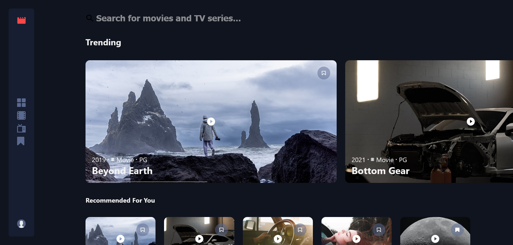

# Movie & TV Show Search App

A web application that allows users to search for movies and TV shows, and bookmark new content.

## Features

- Search for movies and TV shows
- Bookmark movies and TV shows
- Browse ratings, release dates, and descriptions
- Responsive design for desktop and mobile devices

## Tech Stack

### Frontend

- React
- TypeScript
- HTML5
- CSS3

## Screenshots



## Getting Started

Clone the repository:

```bash
git clone https://github.com/nghuthjo/entertainment-web-app.git
```

Install dependencies:

```bash
npm install
```

Start the development server:

```bash
npm run dev
```

Build for production:

```bash
npm run build
```
